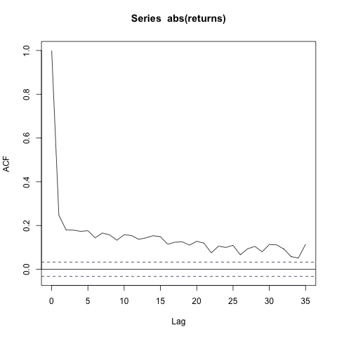
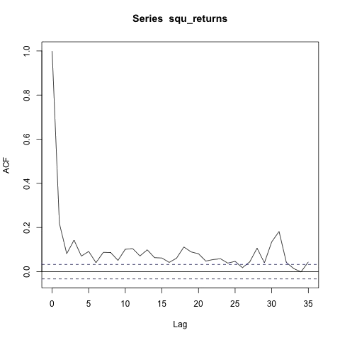

[](http://quantlet.de/)

## [](http://quantlet.de/) **ACFs** [](http://quantlet.de/)

```yaml

Name of Quantlet: 'ACFs'

Published in: 'Multifractal_Models_in_Finance'

Submitted: '07 Mar 2023'

Description: 'Generates plots of ACF of BTC absolute returns and squared returns' 

Keywords: 
- 'Bitcoin'
- 'Cryptocurrencies'
- 'Returns'
- 'Time Series'
- 'ACF'

Output: 
- "acf_abs.jpeg"
- "acf_squ.jpeg"

Author: 
- 'David Alexander Behrens'

```





### R Code
```r

library("crypto2")
c_list <- crypto_list()
c_list <- c_list[which(c_list$id==1),]
df <- crypto_history(c_list)
library(TSstudio)
plot(df$timestamp, df$close, type ="l", xlab= "Date", ylab="Closing Price")

returns <- c()
for (i in 2:length(df$close)) {
  r = (df$close[i]-df$close[i-1])/df$close[i-1]
  returns <- append(returns, r)
}

absolute_returns <- abs(returns)
squared_returns <- returns^2

plot(df$timestamp[2:length(df$timestamp)], squ_returns, type ="l")

x <- acf(absolute_returns, lag.max = NULL,
    type = c("correlation"),
    plot = FALSE, na.action = na.fail, demean = TRUE)

y <- acf(squ_returns, lag.max = NULL,
         type = c("correlation"),
         plot = FALSE, na.action = na.fail, demean = TRUE)

#setwd("")
jpeg(file="acf_abs.jpeg")
plot(x, type="l")
dev.off()

jpeg(file="acf_squ.jpeg")
plot(y, type="l")
dev.off()

```

automatically created on 2023-07-22