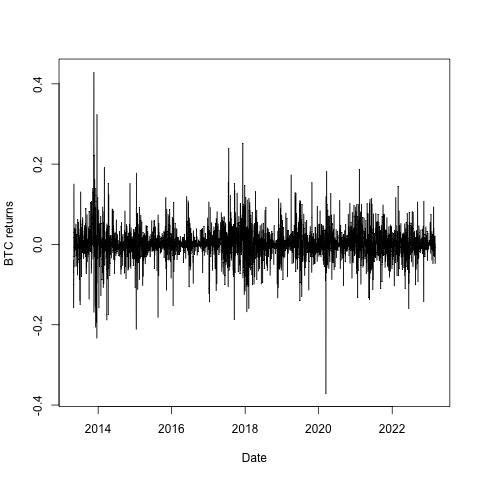

[](http://quantlet.de/)

## [](http://quantlet.de/) **BTC_returns** [](http://quantlet.de/)

```yaml

Name of Quantlet: 'BTC_returns'

Published in: 'Multifractal_Models_in_Finance'

Submitted: '07 Mar 2023'

Description: 'Generates a plot of daily BTC returns from 2012 to 2023' 

Keywords: 
- 'Bitcoin'
- 'Cryptocurrencies'
- 'Returns'
- 'Time Series'
- 'Finance'

Output: 
- "BTC_returns.jpeg"

Author: 
- 'David Alexander Behrens'

```



### R Code
```r

library("crypto2")
c_list <- crypto_list()
c_list <- c_list[which(c_list$id==1),]
df <- crypto_history(c_list)
library(TSstudio)
plot(df$timestamp, df$close, type ="l", xlab= "Date", ylab="Closing Price")

returns <- c()
for (i in 2:length(df$close)) {
  r = (df$close[i]-df$close[i-1])/df$close[i-1]
  returns <- append(returns, r)
}

jpeg(file="BTC_returns.jpeg")

plot(df$timestamp[2:length(df$timestamp)],returns, type ="l", color="blue")
dev.off()
```

automatically created on 2023-07-22