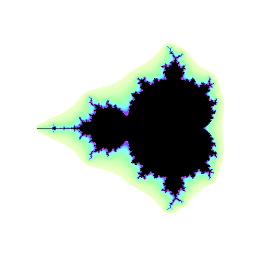
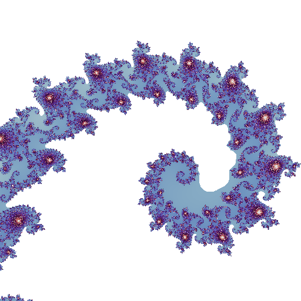

[](http://quantlet.de/)

## [](http://quantlet.de/) **Mandelbrot** [](http://quantlet.de/)

```yaml

Name of Quantlet: 'Mandelbrot'

Published in: 'Multifractal_Models_in_Finance'

Submitted: '05 Mar 2023'

Description: 'Generates two figures of the Mandelbrot set at different scales' 

Keywords: 
- 'Fractals'
- 'Mandelbrot set'
- 'Multifractal'
- 'Geometry'
- 'Scaling'

Output: 
- "Mandelbrot_set.png"
- "Mandelbrot_set_zoomed_in.png"

Author: 
- 'David Alexander Behrens'

```





### PYTHON Code
```python

#!/usr/bin/env python3
# -*- coding: utf-8 -*-
"""
Created on Fri Jan  6 12:05:51 2023

@author: davidalexanderbehrens
"""

import matplotlib.cm
from PIL import Image
from mandelbrot import MandelbrotSet
from viewport import Viewport

def paint(mandelbrot_set, viewport, palette, smooth):
     for pixel in viewport:
         stability = mandelbrot_set.stability(complex(pixel), smooth)
         index = int(min(stability * len(palette), len(palette) - 1))
         pixel.color = palette[index % len(palette)]
         
def denormalize(palette):
     return [
         tuple(int(channel * 255) for channel in color)
         for color in palette
    ]

colormap = matplotlib.cm.get_cmap("twilight").colors
palette = denormalize(colormap)


mandelbrot_set = MandelbrotSet(max_iterations=512, escape_radius=1000)
image = Image.new(mode="RGB", size=(512, 512))
viewport = Viewport(image, center=-0.7435 + 0.1314j, width=0.002)
paint(mandelbrot_set, viewport, palette, smooth=True)
image.show()

from PIL.ImageColor import getrgb

def hsb(hue_degrees: int, saturation: float, brightness: float):
     return getrgb(
         f"hsv({hue_degrees % 360},"
         f"{saturation * 100}%,"
         f"{brightness * 100}%)"
     )

mandelbrot_set = MandelbrotSet(max_iterations=20, escape_radius=1000)
for pixel in Viewport(image, center=-0.75, width=3.5):
     stability = mandelbrot_set.stability(complex(pixel), smooth=True)
     pixel.color = (0, 0, 0) if stability == 1 else hsb(
         hue_degrees=int(stability * 360),
         saturation=stability,
         brightness=1,
     )

image.show()
```

automatically created on 2023-07-22