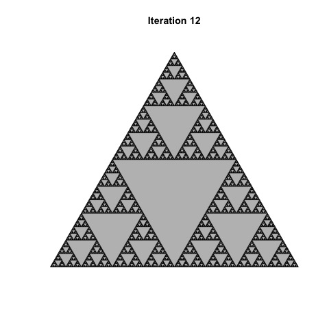

[](http://quantlet.de/)

## [](http://quantlet.de/) **Sierpinski_12** [](http://quantlet.de/)

```yaml

Name of Quantlet: 'Sierpinski_12'

Published in: 'Multifractal_Models_in_Finance'

Submitted: '05 Mar 2023'

Description: 'Generates a figure corresponding to the 12th iteration of the Sierpinski triangle' 

Keywords: 
- 'Fractals'
- 'Multifractal'
- 'Sierpinski'
- 'Geometry'
- 'Scaling'

Output: 
- "sierpinski_12.jpeg"

Author: 
- 'David Alexander Behrens'

```



### R Code
```r

library("spt")
t= st(60, 60)
setwd("")
jpeg(file="sierpinski_12.jpeg")
plot(t, iter=12, main="Iteration 12")
dev.off()
```

automatically created on 2023-07-22